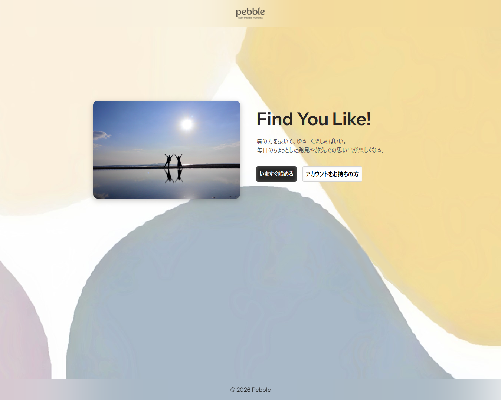

# Pebble（ペブル）

## このサイトについて
このサイトはLaravelの学習用に制作したサイトです。

ユーザー認証機能、つぶやきと画像の投稿、いいね、コメント、各投稿の編集、
ユーザー管理機能、管理者機能、レスポンシブ対応等の基本的なSNSアプリによくある機能を実装しました。

この制作では開発環境の構築、簡易のDB定義書とテスト仕様書の作成、実装後にテストケースに基づいたテストまでを行いました。

サイトの制作は、基本的にLaravelの教科書(https://www.socym.co.jp/book/1511)

を参考にさせていただきました。
本を見ても分からない箇所は公式ドキュメントやエンジニアの方のブログ、学習サイト等も活用しました。

## サイト概要
### サイトテーマ
「日常の小さな『よかった』を持ち寄る、静かな場所」
無駄な機能を削ぎ落とし、1つのタイトル・1つの文章・1枚の写真だけで、日々のちょっとした発見やポジティブな出来事を軽やかに共有するミニマルSNS。

### テーマを選んだ理由
従来のSNSにおける過度な承認欲求の競い合い、愚痴や激しい論争、絶え間ない情報過多（SNS疲れ）から離れられる居場所を作りたいと思い、
散歩中にふと気になった小石を拾うように、日常のささやかな幸せや感動を「ただ置いておける」平和で心地よい気分で使えるSNSを目指しました。

### ターゲットユーザ
- SNSの殺伐とした空気や比較文化、口論等に疲れた方
- 自分の記録やささやかな日常を静かに共有したい方（ポジティブな話題だけを求めている方）
- シンプルな機能を好むミニマリストの方

### 主な利用シーン
- 散歩や移動中：道端で見つけた綺麗な花や、面白い形の雲を1枚撮って投稿
- カフェやランチタイム：美味しかったお菓子や、ほっと一息ついた時間をさっと記録
- 1日の終わりのリラックスタイム：今日あった「ちょっと嬉しかったこと」を投稿

## 開発環境
- OS：Windows11
- 言語：HTML,CSS,JavaScript,PHP,MySQL
- フレームワーク：Laravel
- JSライブラリ：jQuery
- エディター：Visual Studio Code

## 使用素材
写真AC様の画像、一部素材にAI画像生成で生成した画像を使用しております。

また、テスト仕様書はテスター10様の「単体テスト仕様書テンプレート-1」を使用させていただきました。